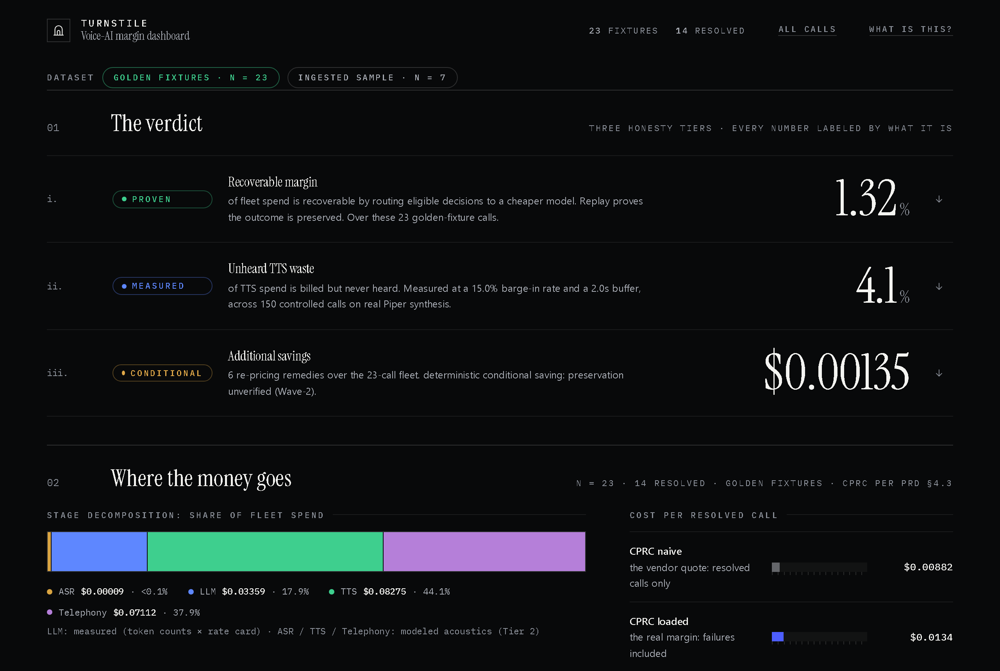

# Turnstile

> A margin profiler for voice AI — the eval nobody runs: **cost**. It prices every turn, decides whether the call resolved, finds ten kinds of waste, and proves each fix by replaying the call on a cheaper path.

[](docs/DEPLOY.md#live-url) [](https://github.com/Pranavk098/turnstile/actions/workflows/ci.yml) [](LICENSE)



## 60-second story

Voice-AI pricing is drifting toward per-resolution and per-minute — so cost-per-resolution *is* gross margin. But LLM observability stops at the token, contact-center analytics never sees the model layer, and voice eval tools measure quality, never cost. Turnstile spans both:

```
call  ->  price  ->  verdict  ->  detect waste  ->  replay cheaper  ->  report
```

The number that started it: **about 4% of text-to-speech spend is generated, billed, and never heard.** When a caller interrupts, the TTS engine — running ~40x faster than real time — has already synthesized the rest of the reply. Measured on real Piper synthesis, with confidence intervals — and fixable: generating in smaller chunks moves the waste from ~4% to 2.3% to 1.2% (sentence → clause → word).

**See it:** the live demo needs zero install — open the fleet, drill into the Detector-7 barge-in call, paste your own call for an instant report. Deployment is in progress; until the URL goes live, run the identical stack locally with `make serve` (details: [docs/DEPLOY.md](docs/DEPLOY.md#live-url)).

## The honesty rule

One rule runs through the whole project: **never claim a number you can't back up.** Every figure wears one of three labels:

- **Measured** — we stand behind it. The 0.57% recoverable margin (exact rate arbitrage, reproducible from every run). The ~4% barge-in waste on real TTS. The 7.8% cheaper-model fork rate with 98.5% outcome preservation on the calls where it agreed.
- **Instrumented, but not measured** — the mechanism works; we don't claim the size yet. The rest of the cost breakdown, and the silence-tax detector on synthetic audio.
- **Not yet measured, and we say so** — divergent-decision preservation at fleet scale, and every headline re-measured on real customer traffic. The tool to measure them is built; the fleet-scale rates are openly small-n and cautionary, never presented as fleet facts.

The full boundaries — what is proven, what is modeled, what is open — live in [METHOD.md](docs/METHOD.md) and [LIMITATIONS.md](docs/LIMITATIONS.md). Start there before quoting any number.

## How it works

Each stage is a small package under `packages/`. The ones that carry the weight: `replay` proves the savings, `verdict` decides whether the call resolved, `detectors` finds the ten waste classes, `ingest` maps real platform logs (native format plus a Vapi adapter) into the pipeline, `service` serves the live demo, and `dashboard` is the report you see.

```bash
uv sync
uv run pytest -q        # 1079 passed, 4 skipped (badge above is the live count)
make demo               # build the report, serve at localhost:8000, open home.html
make serve              # same dashboard + live eval engine at localhost:8000
```

`make demo` needs nothing but `uv` — no keys, no local models, no paid calls. Reproduce the headline margin for free:

```bash
uv run python packages/experiments/run_experiments.py --n 250 --seed 0
```

Paid replay is gated hard. It spends nothing unless you set `TURNSTILE_ALLOW_PAID=1` and `OPENAI_API_KEY`, and it asks before every run.

Run it on **your** calls: the `ingest` package maps real voice-AI logs into Turnstile with no re-instrumentation. See [INGEST.md](docs/INGEST.md) (native format + Vapi call-export adapter).

## Status & limitations

The full pipeline is built and green: pricing, verdict, ten waste detectors, counterfactual replay, a hardened paid-measurement path, real-format call ingestion, a live conversational agent, the dashboard, and the demo service. Barge-in waste and open-loop preservation-under-divergence are both measured at scale on real audio.

Unprompted honesty, up front: **no real customer fleet has been run through Turnstile yet.** Every headline is "the number on *this* data" — a 250-trace generated corpus, golden fixtures, and a 50-call realistic sample. The deterministic margin, the voice-stack waste, and the preservation number all become "your number on your calls" once real data flows in. [LIMITATIONS.md](docs/LIMITATIONS.md) keeps the complete unflattering list.

## License

Apache-2.0 — see [LICENSE](LICENSE) (copyright 2026 Pranav Koduru; attributions in [NOTICE](NOTICE)). Contributions welcome: [CONTRIBUTING.md](CONTRIBUTING.md).
